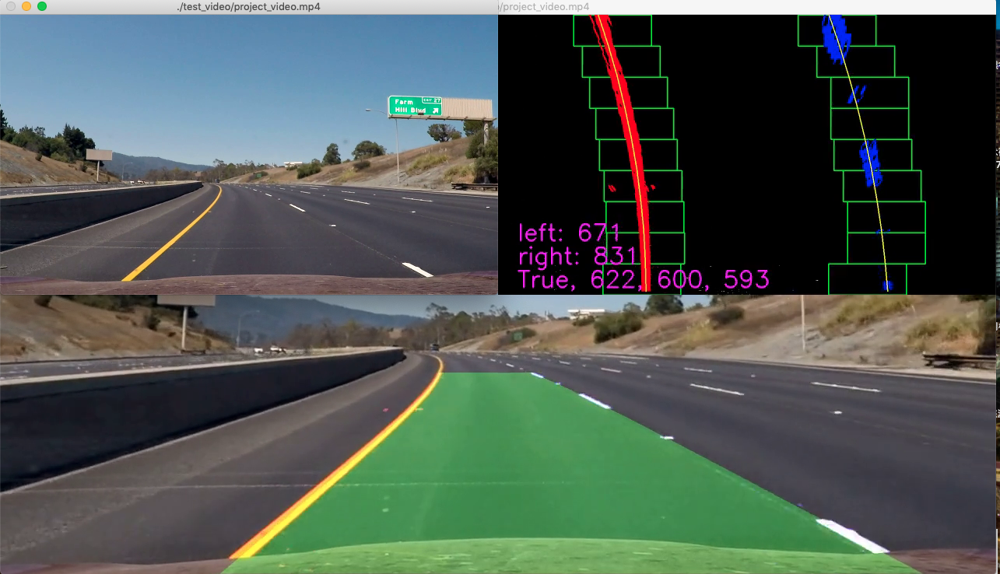
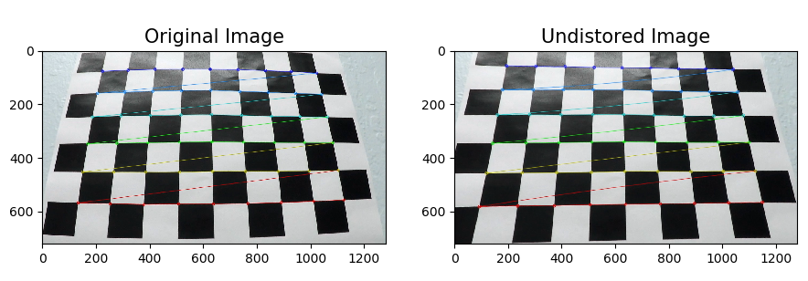
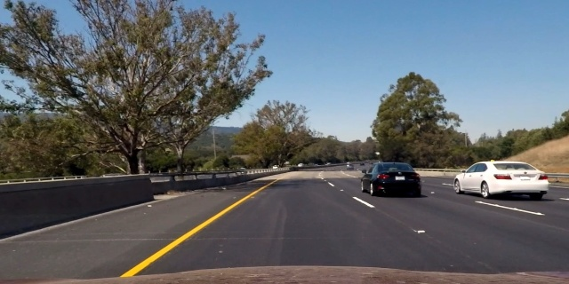
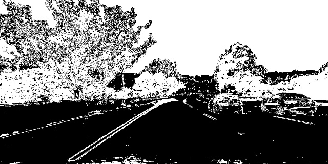
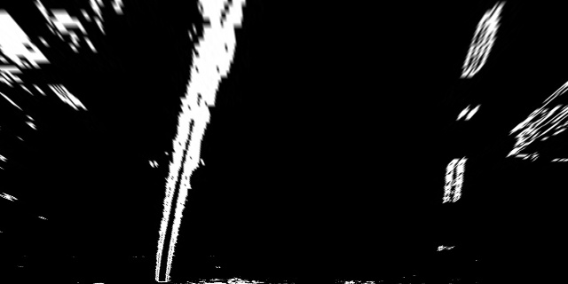
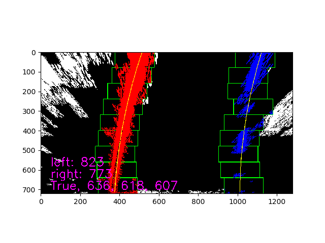
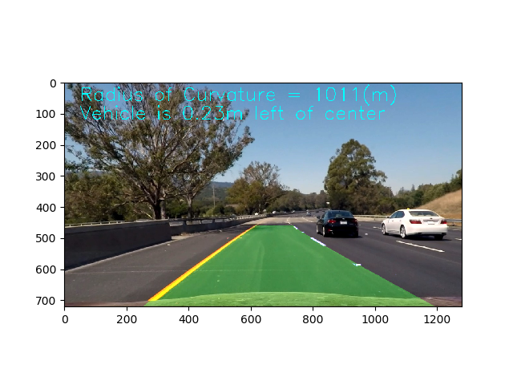
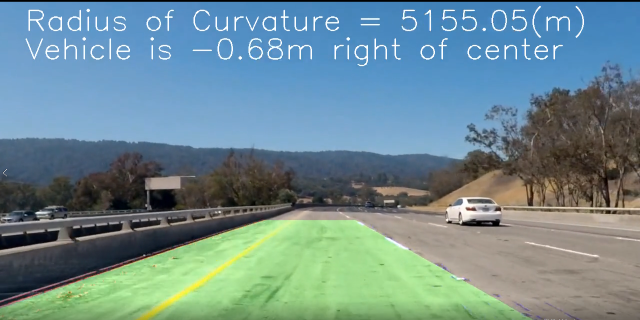
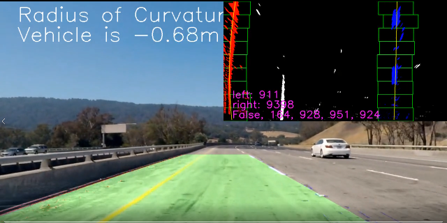
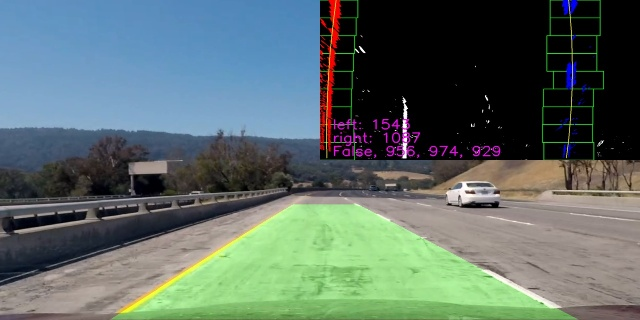

# 在macbook air 上实现 无人驾驶-车道检测
注: 这是Udacity Nano Degree project, 关于项目信息和要求请参考 [Udacity Repository](https://github.com/udacity/CarND-Advanced-Lane-Lines)

这个项目是从 [这里](https://github.com/ChengZhongShen/Advanced_Lane_Lines) 克隆过来的

## 安装OpenCV
首先需要在mac上安装opencv，这个过程并不是很简单，需要下载之后在本地编译，需要一些以来环境，整个搭建还是需要一些耐心细心，大家可以根据这个[帖子]()搭建环境,这个老外写的非常详细，一些常见的问题，在下面的留言里也都进行了解答。

另外，强烈推荐按照上述文档的说明安装python虚拟环境，会将试验环境隔离，比较方便。

## 开发同时显示窗口

这个项目的代码会将未处理的视频导入流程进行处理，处理完成后写入到输出文件夹，不能实时展示，这在需要演示给其他人的时候很不方便。

所以我又新加了一个模块来解决这个问题，大家可以直接使用 `ShowVideoFunction.py`  来同时展示两个视频，也可以在`gen_video.py` 里使用。我也已经更新好了相关代码，会在`pipeline`执行完成后自动启动两个视频的播放。




---
# 下面是原版的中文说明文档
项目目标/步骤如下:

* Compute the camera calibration matrix and distortion coefficients given a set of chessboard images.
* Apply a distortion correction to raw images.
* Use color transforms, gradients, etc., to create a thresholded binary image.
* Apply a perspective transform to rectify binary image ("birds-eye view").
* Detect lane pixels and fit to find the lane boundary.
* Determine the curvature of the lane and vehicle position with respect to center.
* Warp the detected lane boundaries back onto the original image.
* Output visual display of the lane boundaries and numerical estimation of lane curvature and vehicle position.

## 相机标定/Camera Calibration
### 1. 使用opencv findChessboardCorners() 和 calibrateCamera()
这个步骤的代码在 camera_calibration.py文件中，位于 camera_cal 文件夹.
可以单独运行 camera_calibration.py 来进行camera calibration。

在函数 `calibriate()`中, 流程如下: 准备 `objp[]`, 等同于 chessboard 的矩阵 创建 `list objepiont[]` 和 `imgpionts[]` 用来保存3D 和 2D 点. 在所有的图片中搜索标定点，使用 `opencv findChessboardCorners` 函数. 使用 `opencv calibratteCamera()` 来获得 mtx 和 dist 将标定的参数写入pickle文件 camera_cal.p*

测试pickle文件和其所包含的参数 'mtx' 和 'dist' 是否工作，. 使用 `test()` 函数进行测试并可视化结果。 读取pickle文件， 装载 mtx 和 dist 读取测试图像 * 使用 `cv2.undistort()` 来 undistort 图像. 结果如下:



关于相机标定的详细说明，可以参考[OpenCV python tutroal](https://opencv-python-tutroals.readthedocs.io/en/latest/py_tutorials/py_calib3d/py_calibration/py_calibration.html#calibration)，其中有参数的说明和数学原理，以及参考代码。

## Pipeline (single image)
pipeline.py 包括了class Pipeline, 函数 `pipeline()` 该函数对图像进行处理. 可以单独运行 "pipeline.py" 来查看`pipeline()`的效果.
整个流程如下:
### 1. distortion-corrected image（图像变形矫正）.
使用 pickle 文件 `camera_cal.p` 中的参数(由函数: `get_camera_cal()`完成) 使用函数 `cv2.undistort` 获得矫正的图像,参考下图(resized to 640X360 to fit the file.):



### 2. Threshold the image（图像处理）.
所有的图像处理代码在 image_process.py 中。（./helper/image_process.py） pipeline 使用来自 image_process.py 的函数。

```python
s_thresh=(170,255)
sx_thresh=(20, 100)
image_threshed = color_grid_thresh(image_undist, s_thresh=s_thresh, sx_thresh=sx_thresh)
```
采用颜色和梯度两种方法的组合来获的binary image（注：图像中只有两种值，0 或者 1）. 颜色的选择: 将RGB 转换成HLS 后采用 s channel, 对于梯度（gradient·）, 采用 x（水平） 方向. 具体的代码在 image_process.py, 函数 `color_grid_thresh`中，采用之后，如下图.



### 3. Perspective transform（视角转换）
为了进行视角转换, 首先要获得转换的参数 M and Minv. 由文件 view_perspective.py完成（./helper/view_perspective.py）, 如同相机校正, 获得参数之后写入pickle文件以便后续使用。 可以运行 "view_perspective.py" 视角转换的效果.

在获得视角转换的过程中需要在原图中确定四个点（这四个点在视角转换之后为矩形（在本项目应用中）），需要手动调节。 经过数次尝试之后，四个点如下：

```python
src = np.float32(
    [[(img_size[0] / 2) - 63, img_size[1] / 2 + 100],
    [((img_size[0] / 6) - 20), img_size[1]],
    [(img_size[0] * 5 / 6) + 60, img_size[1]],
    [(img_size[0] / 2 + 65), img_size[1] / 2 + 100]])
dst = np.float32(
    [[(img_size[0] / 4), 0],
    [(img_size[0] / 4), img_size[1]],
    [(img_size[0] * 3 / 4), img_size[1]],
    [(img_size[0] * 3 / 4), 0]])

```

对binary image 进行视角转换之后如下图。（转换到这个视角是为了对车道进行相应的计算。）



### 4. Lane-line pixels detection and fit their positions with a polynomial 车道像素检测和车道曲线拟合

lane_detection.py 执行车道像素的检测（./helper/lane_detection.py）. 函数 `find_lane_pixels()` 使用移动窗口来发现车道线的像素. 在捕捉到像素之后使用 `np.polyfit()` 来拟合曲线（二阶）, 由函数 `get_polynomial` 完成左右车道曲线的拟合，在使用的实例图片中，拟合后获得的参数如下. `[A B C]   (Ax^2 + Bx^1 + C*x^0)`

```
[ 1.42425935e-04 -3.09709625e-01  5.13026355e+02]
[ 1.96100345e-04 -2.96906479e-01  1.12235500e+03]
```
对搜索结果和拟合的曲线进行可视化，使用 `fit_polynomial()` 函数. 结果如下图. 显示搜索窗口/车道线像素/拟合曲线。



### 5. Calculate the radius of curvature of the lane and the position of the vehicle with respect to center.计算车道弯曲半径和车辆对于车道中心的偏移量

计算由 cal_curv.py, 中的函数`measure_curv()` 进行。

首先, 将像素转换成米,

```
# Transform pixel to meters
leftx = leftx * xm_per_pix
lefty = lefty * ym_per_pix
rightx = rightx * xm_per_pix
righty = righty * ym_per_pix
```
然后再进行曲线拟合，使用 `np.polyfit()` 函数

获得曲线参数后, 计算半径 $R = (1+(2Ay+B)^2)^3/2 / (|2A|)$

对于车辆偏移，过程相似, 将像素转换成米, 计算车道中心和图像中心的偏移量（假设相机位于车辆的中轴线）. 由函数 `measure_offset()` 完成。

### 6. Plot lane area and display the radius and offset.将车道区域和车道半径/车辆偏移显示到图像中
在类 Pipeline 中, 使用以下代码实现，为了避免计算结果大幅跳动（25frame/s，每秒更新25次） , 采用15 frame的平均值.

```python
def project_fit_lane_info(self, image, color=(0,255,255)):
        """
    project the fited lane information to the image
    use last 15 frame average data to avoid the number quick jump on screen.
    """
    offset = np.mean(self.offset[-15:-1]) if len(self.offset) > self.smooth_number else np.mean(self.offset)
    curverad = np.mean(self.radius[-15:-1]) if len(self.radius) > self.smooth_number else np.mean(self.radius)
    direction = "right" if offset < 0 else "left"
    str_cur = "Radius of Curvature = {}(m)".format(int(curverad))
    str_offset = "Vehicle is {0:.2f}m ".format(abs(offset)) + "{} of center".format(direction)
    cv2.putText(image, str_cur, (50,60), cv2.FONT_HERSHEY_SIMPLEX,2,color,2)
    cv2.putText(image, str_offset, (50,120), cv2.FONT_HERSHEY_SIMPLEX,2,color,2)
```
结果如下图.



在文件 pipeline.py, 可以使用 line 487 to 498, 选择测试一幅图片或者一个文件夹中的图片来测试 `Pipeline.pipeline()` 的效果。

```
if __name__ == '__main__':
    """
    image_test_tracker(), test pipeline on one image and show the image on screen
    images_test_tracker(), test pipeline on images and write the result to related folder
    """
    image_test_tracker("./test_images/test6.jpg", "project", debug_window=False)
    # image_test_tracker("test_images/challenge/1.jpg", "challenge", debug_window=True)
    # image_test_tracker("test_images/harder/1.jpg", "harder", debug_window=True)

    # images_test_tracker("test_images/", "output_images/", "project", debug_window=True)
    # images_test_tracker("test_images/challenge/", "output_images/challenge/", "challenge", debug_window=True)
    # images_test_tracker("test_images/harder/", "output_images/harder/", "harder", debug_window=True)

```

## Pipeline (video) （视频处理）
项目提供了三个视频（project，challenge, harder_challenge）,难度依次提高。（三个文件位于./test_video/） 可以运行gen_video.py将`Pipeline.pipeline()`函数应用到测试视频文件上来产生车道检测的视频。 相应的参数在文档描述中进行了说明。 位于line 66-84

```python
if __name__ == "__main__":
    """
    choise one line to uncoment and run the file, gen the video.
    the video will be output to ./outpu_videos/temp/
    option: subclip = True, just use (0-5) second video, False, use total long video.
    option: debug_window = True, project the debug window on the up-right corner of the screen to visualize the image handle process
                                and write the fit lane failure/search lane failure image to ./output_videos/temp/images
    """
    # get_image("./test_video/challenge_video.mp4", "./test_images/challenge/", [i for i in range(1,16)])
    # get_image("./test_video/harder_challenge_video.mp4", "./test_images/harder/", [i for i in range(1,47)])

    gen_video_tracker("project_video.mp4", subclip=True, debug_window=True) 
    # gen_video_tracker("project_video.mp4", subclip=False, debug_window=False)

    # gen_video_tracker("challenge_video.mp4", subclip=True, debug_window=True) 
    # gen_video_tracker("challenge_video.mp4", subclip=False, debug_window=True)

    # gen_video_tracker("harder_challenge_video.mp4", subclip=True, debug_window=True)
    # gen_video_tracker("harder_challenge_video.mp4", subclip=False, debug_window=False)

```
### 1. Pipeline (video) issue（问题）
基于单个图像建立的`Pipeline.pipeline()`，不能在整个视频中获得100%正确的结果。总是有各种噪声影响车道的检测。

如下图所示，没有检测到正确的车道。



### 2. add debug window on the pictures.（在图像上增加调试窗口）
为了解决这问题，需要知道视频中出错frame的图像处理情况，在图像处理过程中增加调试窗口，同步显示图像处理的过程，使用函数 `project_debug_window()`（该函数属于类Pipeline） 实现，同时检查拟合的曲线是否符合要求。 检查拟合曲线在 y 方向三个位置 720/bot, 360/mid, 0/top 的像素距离并显示在调试窗口上。拟合曲线的检查使用函数 `lane_sanity_check()`， 位于 lane_detection.py 文件中。

```
lane_distance_bot = right_fitx[720] - left_fitx[720]
    lane_distance_mid = right_fitx[320] - left_fitx[320]
    lane_distance_top = right_fitx[0] - left_fitx[0]

```

调试窗口如下图所示




当检测到拟合曲线（车道）不符合要求，使用最近一次的合格的拟合曲线. 来显示车道。



### 3 project video 项目视频

使用 Pipeline.pipeline(), 跳过有噪声frame, pipeline 在这个视频上工作的相当不错。

项目视频链接 [project_video.mp4](https://v.qq.com/x/page/z0734jrjohv.html).

带调试窗口的视频链接 [project_video_with_debug_window.mp4](https://v.qq.com/x/page/r0734he9q9g.html).


### 4. challenge video 挑战视频

挑战视频包含的噪声更多，主要是右边车道线边上栏杆形成的噪声，以及路面色差形成的噪声.主要通过改进图像处理函数。采用的新的函数。基本工作（具体请参考代码）

挑战视频链接 [challenge_video.mp4](https://v.qq.com/x/page/p0734wfsif6.html).

带调试窗口的视频链接 [challenge_video_with_debug_window](https://v.qq.com/x/page/u0734epwuj4.html).

### 5. harder chanllenge 更难挑战视频
左右两边车道线噪声更多，车道弯曲的很厉害，视频照明情况变化很大，部分frame曝光过度，无法提取有效信息。改进的图像处理函数，车道像素搜索函数。还是有部分frame不工作，在视频中可以明显看到拟合的车道线与实际车道线分离。

更难挑战视频链接 [harder_challenge_video.mp4](https://v.qq.com/x/page/z0734k1f9e6.html).

带调试窗口更难挑战视频链接 [harder_challenge_video_with_debug_window.mp4](https://v.qq.com/x/page/w0734z2dudr.html)

## Discussion/讨论
### 1. the time/efficiency issue 时间和效率
find_lane_pixels() (helpers/lane_detection.py) 用来搜索处理后图像中车道像素。项目中处理的是离线视频，所以没有考虑搜索的效率。在实际的的应用中，需要考虑到效率，需要实施处理摄像头传来的图像。需要快速的搜索。（例如，基于上一次的搜索结果进行搜索）。
### 2. lane_sanity check 拟合车道线的检查

lane_sanity_check() (helpers/lane_detection.py) 函数相当简单。. 仅仅比较三个y位置的距离。 当车道弯曲的不是很厉害的时候可以工作。但是当车道弯曲的比较厉害的时候就会有问题，在第三视频的调试窗口中可以看到车道拟合目测OK， 但是被判为不合格的情况。需要使用其他方法来判定。


